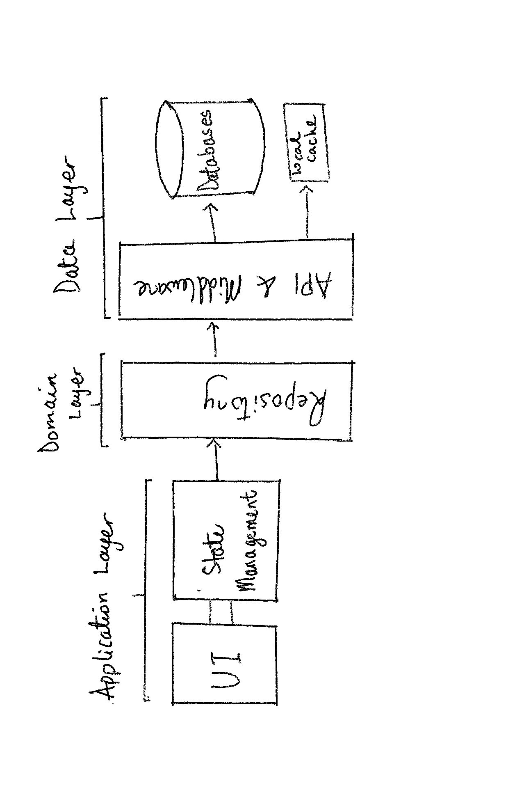

## bifröst

BIFRÖST is a social networking platform that connects students with mentors and 
other students to get help with assignments and/or to form study groups.

## Features
- [ ] Assist
- [ ] Assist History
- [ ] News Feed
- [ ] Messaging 
  - [ ] Direct Messaging
  - [ ] Group Messaging
- [ ] Search
  - [ ] Posts Search
  - [ ] Study Group Search
- [ ] User Profile
- [ ] Settings
- [ ] Login/SignUp 

## Getting Started

This project is a starting point for a Flutter application.

A few resources to get you started if this is your first Flutter project:

- [Lab: Write your first Flutter app](https://docs.flutter.dev/get-started/codelab)
- [Cookbook: Useful Flutter samples](https://docs.flutter.dev/cookbook)

For help getting started with Flutter development, view the
[online documentation](https://docs.flutter.dev/), which offers tutorials,
samples, guidance on mobile development, and a full API reference.

## Project Structure
``` 
├── android
├── ios
├── lib
│   └── main.dart
├── packages
│   ├── package_1
│   └── lib
│   │   └── src
│   │       └── package_1_base.dart
│   │   ├── package_1.dart
│   └── test
│   │   ├── package_1_test.dart
├── test
└── pubspec.yaml
└── README.md
```
## Architecture
</img>
### Application Layer
- [ ] Presentation (UI/UX)
  - [ ] Flutter UI Framework
- [ ] State Management
  - [ ] BLoC Design Pattern
### Domain Layer
- [ ] Repositories
  - [ ] Assist Repository
  - [ ] Post Repository
  - [ ] Chat Repository
  - [ ] Search Repository
  - [ ] Authentication Repository
  - [ ] User Repository
  - [ ] Storage Repository
  - [ ] UserMap Repository
  - [ ] Notification Repository
### Data Layer
- [ ] API & Middleware
  - [ ] Assist Service
  - [ ] Post Service
  - [ ] Chat Service
  - [ ] Search Service
  - [ ] Authentication Service
  - [ ] Storage Service
  - [ ] UserMap Service
  - [ ] Notification Service
- [ ] Databases
  - [ ] External Databases
  - [ ] Local Database
    - [x] Cache


